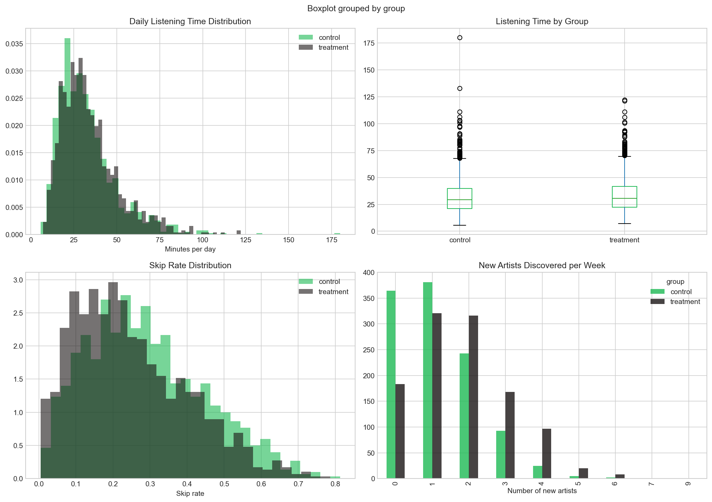
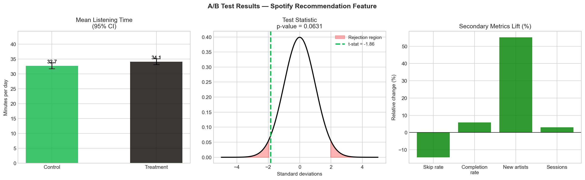

# Spotify Recommendation A/B Test

A statistical analysis of a new AI-powered recommendation algorithm, measuring its impact on user engagement metrics.

## Business Question

Does the new AI recommendation algorithm increase average daily listening time compared to the existing algorithm?

## Hypothesis

- **H₀:** The new recommendation feature has no effect on daily listening time
- **H₁:** The new recommendation feature increases daily listening time

## Experiment Design

| Parameter | Value |
|-----------|-------|
| Control group | Existing recommendation algorithm |
| Treatment group | New AI-powered recommendation algorithm |
| Primary metric | Average daily listening time (minutes) |
| Significance level (α) | 0.05 |
| Statistical power | 0.80 |
| Sample size (per group) | 1,114 users |

**Secondary metrics:** skip rate, playlist completion rate, new artist discovery rate, daily sessions.

## Results

### Primary Metric — Daily Listening Time

| Group | Mean (min/day) |
|-------|---------------|
| Control | 32.72 |
| Treatment | 34.07 |
| Lift | +1.35 min (+4.1%) |

- 95% CI for difference: [−0.07, 2.77]
- Welch's t-test p-value: **0.063** (not significant at α = 0.05)
- Mann-Whitney U p-value: 0.006
- Cohen's d: 0.079

### Secondary Metrics

| Metric | Lift | Significant |
|--------|------|-------------|
| Skip rate | −14.3% (improved) | ✓ |
| Playlist completion rate | +5.8% | ✓ |
| New artists discovered | +55.2% | ✓ |
| Daily sessions | +3.0% | ✗ |

### Business Impact Estimate

| | Value |
|-|-------|
| Monthly revenue uplift | €111,222 |
| Annual revenue uplift | €1,334,659 |

### Decision

**DO NOT SHIP** — the primary metric (listening time) did not reach statistical significance (p = 0.063 > 0.05), though the trend is positive and all secondary metrics improved significantly. Recommendation: extend the experiment duration to increase power.

## Visualizations

| | |
|--|--|
|  |  |

## Project Structure

```
spotify_ab_test.ipynb   # Main analysis notebook
ab_test_distributions.png
ab_test_results.png
README.md
```

## Requirements

```bash
pip install numpy pandas matplotlib seaborn scipy
```

## How to Run

```bash
jupyter notebook spotify_ab_test.ipynb
```

## Methodology

1. **Sample size calculation** — power analysis (z-test) to determine minimum required users
2. **Data simulation** — log-normal distributions to model realistic right-skewed listening behavior
3. **EDA** — distribution plots, box plots, and metric comparisons across groups
4. **Statistical testing** — Welch's t-test + Mann-Whitney U (non-parametric) due to non-normal data
5. **Effect size** — Cohen's d to assess practical significance at scale
6. **Business impact** — revenue estimation based on retention correlation model
